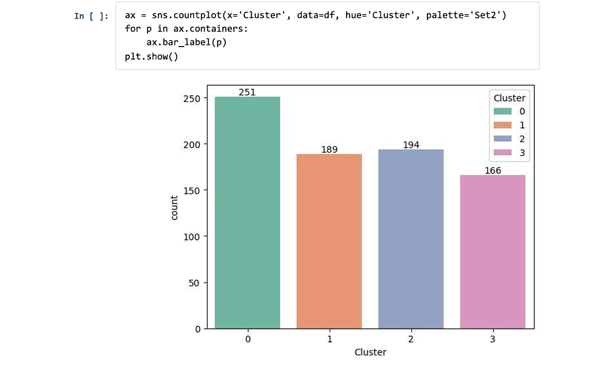
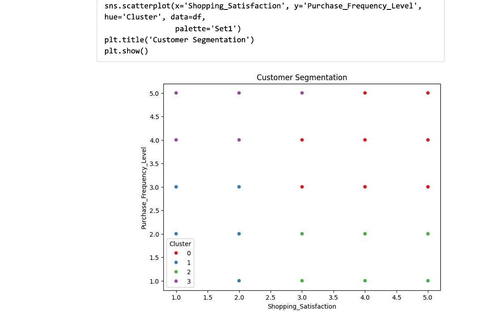

# 🛒 Snapdeal Customer Purchasing Behavior & Product Recommendation Analysis
Snapdeal Customer Behaviour and Product Performance Analytics using Python and ML models. 

## 📌 Project Overview

This project analyzes customer purchasing behavior and shopping patterns for **Snapdeal**, an e-commerce platform. The objective is to transform customer survey data into actionable insights that can support:

- Customer segmentation
- Personalized recommendations
- Customer retention
- Cross-selling opportunities
- Inventory planning
- Shopping experience improvement
- Review and recommendation system optimization

The analysis was performed using **Python, Pandas, NumPy, Matplotlib, Seaborn, and Scikit-learn**.

---

## 🎯 Business Objectives

The project focuses on understanding:

1. Which product categories are most popular among customers?
2. How frequently do customers browse and purchase?
3. What factors contribute to cart abandonment?
4. How satisfied are Snapdeal customers with their shopping experience?
5. Can customers be segmented based on purchasing frequency and satisfaction?
6. How useful do customers find personalized recommendations?
7. Does recommendation helpfulness have a strong relationship with shopping satisfaction?
8. How do review reliability and helpfulness relate to customer satisfaction?
9. What personalized strategies can Snapdeal use for different customer segments?

---

## 📂 Dataset

The dataset contains customer survey responses covering:

- Demographics
- Purchase frequency
- Purchase categories
- Browsing frequency
- Product search behavior
- Search result exploration
- Cart behavior
- Cart abandonment
- Save-for-later behavior
- Review engagement
- Review reliability
- Review helpfulness
- Recommendation helpfulness
- Personalized recommendation frequency
- Rating accuracy
- Shopping satisfaction
- Service appreciation
- Areas for improvement

### Dataset Size

- **Rows:** 800
- **Initial Columns:** 24
- **Final analytical columns:** 19+ derived variables depending on the analysis

---

## 🧹 1. Data Cleaning & Preparation

The first stage focused on improving the quality and consistency of the dataset.

### Data Quality Checks
- Checked dataset shape and data types.
- Checked for duplicate records.
- Standardized categorical values by removing extra spaces.
- Identified missing values.
- Removed the duplicate Personalized_Recommendation_Frequency column.
- Added Unknown for missing Product_Search_Method values.
- Verified numerical columns such as: age, Customer_Reviews_Importance, Rating_Accuracy

## 📊 2. Descriptive Customer Behavior Analysis

### 👥 Customer Demographics

The gender distribution was relatively balanced:

| Gender | Share |
| :--- | :--- |
| Male | 26.6% |
| Female | 25.1% |
| Prefer not to say | 24.2% |
| Others | 24.0% |

Age
- **Mean Age:** 36.05
- **Median Age:** 37
- **Minimum:** 3
- **Maximum:** 67

---

### 🛍️ Purchase Frequency

Customer purchase frequency was relatively evenly distributed.

| Purchase Frequency | Share |
| :--- | :--- |
| Multiple times a week | 20.75% |
| Once a month | 20.50% |
| Once a week | 20.13% |
| Few times a month | 19.62% |
| Less than once a month | 19.00% |

> **Note:** This indicates that there is no single dominant purchasing-frequency group.

---

## 🛒 Purchase Category Analysis

Customers could select multiple purchase categories in a single response. Therefore, the `Purchase_Categories` column was split using `;` and then exploded into individual rows before calculating category popularity.

### Category Participation

| Product Category | Share |
| :--- | :--- |
| Clothing and Fashion | 22.97% |
| Beauty and Personal Care | 19.98% |
| Home and Kitchen | 19.55% |
| Others | 19.11% |
| Groceries and Gourmet Food | 18.39% |

### 💡 Key Insight
**Clothing and Fashion** was the most popular individual purchase category. This provides an opportunity for Snapdeal to prioritize inventory planning and explore cross-category recommendations around fashion products.

---

## 🌐 3. Browsing Behavior

Customer browsing frequency was also relatively distributed.

| Browsing Frequency | Share |
| :--- | :--- |
| Multiple times a day | 25.50% |
| Few times a week | 25.25% |
| Few times a month | 24.88% |
| Rarely | 24.38% |

### 💡 Key Insight
More than half of customers browse either **multiple times a day** or **a few times a week**, indicating a significant opportunity to convert browsing activity into purchases through relevant recommendations and targeted promotions.

---

## 🛒 4. Cart Abandonment Analysis

The most common cart-abandonment factors included:

| Cart Abandonment Factor | Share |
| :--- | :--- |
| Better price elsewhere | 27.38% |
| Other factors | 24.50% |
| High shipping costs | 24.25% |

### 💡 Key Insight
Price sensitivity is an important cart-abandonment factor. Snapdeal can potentially address this through:

* Competitive pricing
* Targeted coupons
* Price-based promotions
* Shipping-cost optimizations

## ⭐ 5. Satisfaction Analysis

Shopping satisfaction was measured on a 1–5 scale.

### Satisfaction Distribution

| Satisfaction Level | Share |
| :---: | :--- |
| 1 | 19.50% |
| 2 | 20.50% |
| 3 | 22.12% |
| 4 | 17.37% |
| 5 | 20.50% |

### Overall Statistics

| Metric | Mean | Median |
| :--- | :---: | :---: |
| Shopping Satisfaction | 2.99 | 3.00 |
| Recommendation Helpfulness | ~2.00 | 2.00 |
| Rating Accuracy | 2.96 | 3.00 |

### 💡 Key Insight
Customer satisfaction is centered around the middle of the scale, suggesting a mixed customer experience rather than an overwhelmingly positive or negative one.

---

## 👥 6. Customer Segmentation

Customer segmentation was performed using two approaches:

### A. Rule-Based Segmentation
Customers were classified based on purchase frequency, shopping satisfaction, and cart completion behavior. Example profiles included:
* Frequent Buyers
* Occasional Shoppers
* At-Risk Customers

### B. K-Means Clustering
K-Means clustering was used to identify behavioral groups. The clustering analysis focused on `Shopping_Satisfaction` and `Purchase_Frequency_Level`. Both the **Elbow Method** and **Silhouette Score** were evaluated.

* **Optimal Number of Clusters:** 4 clusters provided the most interpretable solution.

---

## 🔵 7. K-Means Customer Profiles

The four clusters were interpreted based on average satisfaction and purchase frequency.

| Cluster | Customers | Avg. Satisfaction | Avg. Purchase Frequency | Profile |
| :--- | :---: | :---: | :---: | :--- |
| **Cluster 0** | 251 | 4.13 | 3.89 | 🟢 Loyal / Frequent Buyers |
| **Cluster 1** | 189 | 1.51 | 2.08 | 🔴 At-Risk / Disengaged |
| **Cluster 2** | 194 | 3.95 | 1.48 | 🔵 Satisfied Occasional Shoppers |
| **Cluster 3** | 166 | 1.83 | 4.63 | 🟠 Frequent but Dissatisfied |

### 🎯 Segment-Specific Strategies

#### 🟢 Cluster 0 — Loyal / Frequent Buyers
* **Characteristics:** High purchase frequency, high satisfaction.
* **Business Goal:** Increase customer lifetime value and retention.
* **Recommended Strategy:**
  * Loyalty rewards & exclusive offers
  * Personalized cross-selling & recommendations
  * Early access to products

#### 🔵 Cluster 2 — Satisfied Occasional Shoppers
* **Characteristics:** High satisfaction, lower purchase frequency.
* **Business Goal:** Convert satisfied occasional shoppers into frequent customers.
* **Recommended Strategy:**
  * Personalized promotions & repeat-purchase incentives
  * Complementary product recommendations
  * Category-based offers & loyalty-point incentives

#### 🟠 Cluster 3 — Frequent but Dissatisfied
* **Characteristics:** Very high purchase frequency, low satisfaction. 
* *Note: This is an important customer group because these customers are active but potentially vulnerable to churn.*
* **Business Goal:** Protect high-value customers and reduce churn.
* **Recommended Strategy:**
  * Identify dissatisfaction drivers & improve service experience
  * Address cart and checkout issues
  * Improve product information & use service recovery initiatives

#### 🔴 Cluster 1 — At-Risk / Disengaged
* **Characteristics:** Lower purchase frequency, low satisfaction.
* **Business Goal:** Recover customers and increase engagement.
* **Recommended Strategy:**
  * Personalized re-engagement campaigns & targeted discounts
  * Relevant product recommendations
  * Address major abandonment barriers & improve customer experience

---

## 🤖 8. Recommendation & Review Insights

### Recommendation Helpfulness vs Shopping Satisfaction
- **Correlation Value:** `0.040151` (Indicates a very weak relationship)

### Group-Level Finding
Customers who reported that recommendations were not helpful had lower average satisfaction compared with customers who reported recommendations as sometimes or always helpful.

| Recommendation Helpfulness | Avg. Satisfaction |
| :--- | :---: |
| No | 2.89 |
| Sometimes | 3.08 |
| Yes | 3.02 |

> **Insight:** Overall satisfaction does not depend entirely on recommendation helpfulness. Therefore, Snapdeal should focus on recommendation quality and relevance, rather than simply increasing recommendation frequency.

---

## ⭐ 9. Review Reliability & Helpfulness

The relationship between review-related variables and shopping satisfaction was very weak.

| Variable | Correlation with Satisfaction |
| :--- | :---: |
| Review Helpfulness | 0.02 |
| Review Reliability | 0.02 |

*Note: Average ratings were also broadly similar across the different review-helpfulness and review-reliability groups.*

> **Insight:** Review reliability and helpfulness alone do not appear to be strong drivers of overall satisfaction in this dataset. Snapdeal can instead focus on verified reviews, accurate product information, rating quality, review authenticity, and helpful-review ranking.

---

## 📱 10. Personalized Recommendation Engagement

Personalized recommendation frequency showed a decreasing count trend from levels 1 to 5.

| Frequency Level | Count | Share |
| :---: | :---: | :--- |
| 1 | 173 | 21.62% |
| 2 | 166 | 20.75% |
| 3 | 163 | 20.37% |
| 4 | 155 | 19.38% |
| 5 | 143 | 17.88% |

- **Correlation with Shopping Satisfaction:** `~0.017` (Negligible relationship)

---

## 🔎 11. Recommendation Engagement by Customer Segment

Average personalized recommendation frequency by cluster:

| Cluster | Avg. Recommendation Frequency | Avg. Satisfaction |
| :--- | :---: | :---: |
| **Cluster 0** | 2.89 | 4.13 |
| **Cluster 1** | 2.92 | 1.51 |
| **Cluster 2** | 3.00 | 3.95 |
| **Cluster 3** | 2.84 | 1.83 |

### Key Findings
* **Cluster 2** has the highest average personalized recommendation frequency.
* **Clusters 0 and 3** are high-purchase-frequency groups but have lower recommendation frequency.
* Recommendation helpfulness is higher among the more satisfied clusters, particularly Clusters 0 and 2.

### 💡 Business Opportunity
Snapdeal can improve the frequency and quality of personalized recommendations for high-purchase-frequency customers, especially **Clusters 0 and 3**.

---

## 💡 12. Key Business Recommendations

1. **Improve Personalization for High-Value Customers:** Increase the relevance and quality of recommendations for high-frequency customers using purchase history, browsing behavior, and product category preferences.
2. **Use Segment-Specific Recommendation Strategies:** Avoid applying the same recommendation strategy to every customer. Different segments should receive different recommendation frequencies, product types, promotional offers, and cross-selling suggestions.
3. **Prioritize Recommendation Quality:** The very low correlation between recommendation helpfulness and satisfaction suggests that simply increasing recommendation frequency is not enough. Focus on product relevance, personalization, recent browsing behavior, purchase history, and complementary products.
4. **Improve Customer Experience for Frequent but Dissatisfied Customers:** Cluster 3 contains customers who purchase frequently but report low satisfaction. This segment should be investigated for service issues, product expectations, cart abandonment, delivery experience, and product information quality.
5. **Target Price-Sensitive Customers:** Since finding a better price elsewhere is the most common cart-abandonment factor, Snapdeal can use competitive pricing, targeted discounts, personalized coupons, and price-value messaging.
6. **Strengthen Review Trust:** Improve verified reviews, product rating accuracy, review quality controls, product descriptions, and review ranking/filtering systems.

---

## 📈 13. Visualizations

The project includes visualizations for:
* Purchase category distribution & purchase frequency
* Browsing frequency & cart abandonment factors
* Shopping satisfaction & cart completion frequency
* Customer segmentation & K-Means clusters
* Recommendation helpfulness vs satisfaction
* Review helpfulness/reliability
* Personalized recommendation frequency & engagement by segment

### Main Visualization Types
* Bar Charts & Count Plots
* Heatmaps & Scatter Plots
* Cluster Visualizations & Distribution Charts

---

## 🧰 14. Technologies Used

| Technology | Purpose |
| :--- | :--- |
| **Python** | Data analysis |
| **Pandas** | Data cleaning & manipulation |
| **NumPy** | Numerical operations |
| **Matplotlib** | Data visualization |
| **Seaborn** | Statistical visualization |
| **Scikit-learn** | K-Means clustering & evaluation |
| **Google Colab** | Analysis environment |

## 🔬 16. Analytical Methods

### Data Cleaning
* Duplicate detection
* Missing-value handling
* Categorical standardization
* Data-type validation
* Column-name cleaning

### Exploratory Data Analysis
* Frequency distributions
* Percentage analysis
* Mean and median calculations
* Cross-tabulation
* Group-level comparisons
* Correlation analysis

### Customer Segmentation
* Rule-based segmentation
* Feature transformation & standardization
* K-Means clustering (Elbow Method & Silhouette Score)
* Cluster profiling

### Recommendation Analysis
* Recommendation helpfulness & frequency analysis
* Satisfaction comparison metrics
* Review reliability & helpfulness analysis
* Segment-level recommendation analysis

---

## ⚠️ 17. Limitations

The analysis is based on survey data, which represents customer-reported behavior and perceptions. Important limitations include:

* **No Transactional Baskets:** The dataset does not provide detailed transaction-level product baskets.
* **Causation:** Correlation does not imply causation.
* **Effectiveness Metrics:** Recommendation frequency cannot by itself establish recommendation effectiveness.
* **Validation:** Customer segments should ideally be validated against actual transaction behavior.
* **Temporal Analysis:** The Timestamp column was retained but not used for temporal trend analysis.

---

## 🚀 18. Future Scope

Future versions of the project can be extended with:

### 🛍️ Market Basket Analysis
Using actual transaction-level product data with:
* Apriori & FP-Growth algorithms
* Association Rules evaluation using **Support**, **Confidence**, and **Lift**

### 🤖 Recommendation System
Build a functional product recommendation engine powered by:
* Collaborative filtering & Content-based filtering
* Customer purchase history & browsing behavior
* Category affinity & customer segmentation data

### 📈 Interactive Dashboard
Create a visualization suite using **Power BI**, **Tableau**, or **Streamlit** to allow business users to explore customer segments, categories, satisfaction, and recommendation behavior interactively.

---

## 🏁 Conclusion

The analysis demonstrates how Snapdeal's customer survey data can be transformed into actionable customer intelligence. The most important segmentation insight is that purchase frequency and shopping satisfaction provide a clear basis for differentiating customer behavior.

The four K-Means clusters reveal four distinct customer profiles:

$$\text{High Frequency} + \text{High Satisfaction} \longrightarrow \textbf{Loyal / Frequent Buyers}$$
$$\text{Low Frequency} + \text{High Satisfaction} \longrightarrow \textbf{Satisfied Occasional Shoppers}$$
$$\text{High Frequency} + \text{Low Satisfaction} \longrightarrow \textbf{Frequent but Dissatisfied}$$
$$\text{Low Frequency} + \text{Low Satisfaction} \longrightarrow \textbf{At-Risk / Disengaged}$$

This segmentation allows Snapdeal to move away from a one-size-fits-all marketing strategy and toward segment-specific personalization, retention, and customer experience initiatives.

> **Final Takeaway:**  
> Snapdeal should focus on **better personalization, customer experience, targeted promotions, and segment-specific engagement** rather than simply increasing the volume of generic recommendations or promotions.

---

## 👨‍💻 Project Skills Demonstrated
* **Core Analytics:** Python, Data Cleaning, Exploratory Data Analysis (EDA), Statistical Analysis
* **Machine Learning:** Customer Segmentation, K-Means Clustering, Silhouette Analysis
* **Business Strategy:** Business Intelligence, Customer Insights, Recommendation Analysis, Strategic Business Recommendations

## 👤 Project Type
* **Classification:** End-to-End Customer Analytics Project
* **Domains:** E-Commerce, Customer Analytics, Marketing Analytics, Recommendation Systems, Business Intelligence

